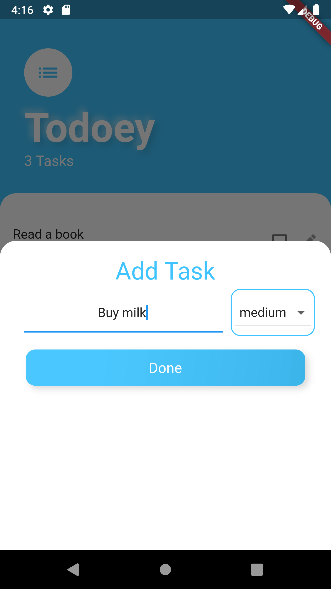

# Todoey_flutter
A simple Flutter To-do project for exercising.

## Getting Started
This project is a starting point for a Flutter application.

A few resources to get you started if this is your first Flutter project:

- [Lab: Write your first Flutter app](https://flutter.dev/docs/get-started/codelab)
- [Cookbook: Useful Flutter samples](https://flutter.dev/docs/cookbook)
## Screenshots

<table>
<tr>
<td>

</td>
<td>

</td>
</tr>
</table>

## To-do lists
- [ ] Add priority to tasks
- [ ] Sort task by not finished tasks
- [ ] Add edit task
- [ ] Add dark theme
- [ ] Control tasks by swipe right or left
